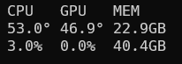
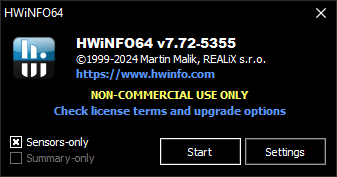
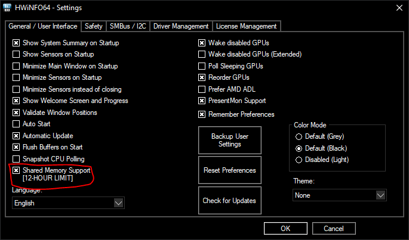

# HWiNFO-SteelSeries OLED

Display real-time hardware monitoring data from HWiNFO on your SteelSeries OLED screens. Lightweight, customizable, and easy to configure.



## Features

- **Low Resource Usage**: Uses only ~4MB of RAM and minimal CPU
- **Multiple Display Modes**:
  - **Summary Mode**: Pre-configured CPU/GPU/MEM layouts (Vertical or Horizontal)
  - **Custom Mode**: Choose any sensors from HWiNFO with full control
- **Multi-Page Support**: Cycle through multiple pages of sensor data
- **Real-Time Updates**: Direct access to HWiNFO's shared memory for instant updates
- **Easy Configuration**: Simple INI-based configuration file
- **System Tray Integration**: Runs quietly in the background

## Supported Devices

Any SteelSeries device with an OLED screen supported by SteelSeries GG:
- Arctis Pro Wireless
- Arctis Nova Pro Wireless
- Apex Pro
- Apex Pro TKL
- GameDAC

## Requirements

### Software

- **Windows 10/11** (64-bit)
- **[HWiNFO](https://www.hwinfo.com/)** (v7.0 or later recommended)
- **[SteelSeries GG](https://steelseries.com/gg)** (latest version)

### Hardware

- A SteelSeries device with OLED screen support

## Installation

### Option 1: Download Pre-built Binary

1. Download the latest `hwinfo-steelseries-oled.exe` from the [Releases](../../releases) page
2. Place it in a folder of your choice
3. Run the executable - it will guide you through initial setup

### Option 2: Build from Source

See [Building from Source](#building-from-source) section below.

## Setup

### 1. Configure HWiNFO

1. Launch HWiNFO and click **Start with Sensors** checked

   

2. Open HWiNFO Settings (click the gear icon in the Sensors window)
3. Enable **Shared Memory Support** under the "General" section

   

4. Keep HWiNFO running in the background

### 2. Launch SteelSeries GG

Make sure SteelSeries GG is running and your device is connected.

### 3. Run HWiNFO-SteelSeries OLED

Run `hwinfo-steelseries-oled.exe`. On first launch:

1. You'll be prompted to choose a display style:
   - **Summary Vertical**: 3-column layout (CPU/GPU/MEM)
   - **Summary Horizontal**: 3-row layout
   - **Custom**: Choose your own sensors

2. For **Summary** modes with multiple GPUs, you'll be asked to select which GPU to monitor

3. For **Custom** mode, you'll configure:
   - Number of lines (2-5)
   - Sensors per line (1-3)
   - Which specific sensors to display

4. Configuration is saved to `conf.ini` in the same directory

The application will start displaying data on your SteelSeries OLED screen.

## Usage

### System Tray Menu

The application runs in the system tray with the following options available via right-click:

- **Settings...**: Opens the configuration GUI to modify your display settings (also wakes the display if in sleep/white screen mode)
- **Reload Config**: Reloads the `conf.ini` file without restarting the application (also wakes the display if in sleep/white screen mode)
- **Sleep Display**: Puts the OLED screen to sleep by clearing it (all pixels off) and stopping updates. The screen stays blank until you wake it up.
- **White Screen**: Fills the OLED screen with white (all pixels on) and stops updates. Useful for testing the display or as a flashlight. The screen stays white until you wake it up.
- **Exit**: Stops the application and closes the OLED display

**Waking Up**: To resume normal operation from Sleep Display or White Screen mode, use Settings or Reload Config from the tray menu, or double-click the tray icon to open the Settings GUI.

## Configuration

### Summary Modes

#### Vertical Layout
```
CPU   GPU   MEM
55°   45°   8.6G
10%   0.0%  32G
```

#### Horizontal Layout
```
CPU  45°  10.0%
GPU  35°  0.0%
MEM  10G  33.3%
```

### Summary Mode Configuration

```ini
[Main]
style=Vertical    # or Horizontal
decimal=true      # Show decimal places (true/false)
gpu=GPU [#0]: NVIDIA GeForce RTX 3090  # Specific GPU (if multiple GPUs)
```

### Custom Mode Configuration

Custom mode allows you to display any sensor from HWiNFO with full control over labels and units.

```ini
[Main]
style=Custom
sensors_per_line=3  # 1-3 sensors per line
pages=1             # Number of pages
page_time=10        # Seconds between page switches
decimal=false       # Show decimal places
direct_usb=true     # Direct USB (HID) connection

[PAGE1.Sensors]
sensor_0="CLOCK"
label_0="Time:"
unit_0=""

# ... more sensors up to sensor_14 (5 lines * 3 sensors) ...

sensor_12="Network: Intel Ethernet Controller I225-V;Current UP rate"
label_12="NET ^"
unit_12="mb/s"
convert_12="kb/mb"

sensor_13="Network: Intel Ethernet Controller I225-V;Current DL rate"
label_13="NET v"
unit_13="mb/s"
convert_13="kb/mb"
```

#### Custom Mode Output Examples

**Page 1:**
```
FPS 144 GPU 45° 12%
CPU 55° 08% 89W
```

**Page 2:**
```
RAM 15G 48G 23%
NET ▲ 125k/s
NET ▼ 1.2M/s
```

### Sensor Format

Sensors are specified as: `"Sensor Category;Reading Name"`

To find sensor names:
1. Look at HWiNFO Sensors window
2. The category is the main sensor name (e.g., "GPU [#0]: NVIDIA GeForce RTX 3090")
3. The reading is the specific metric (e.g., "GPU Temperature")

### Special Sensors

Special sensors don't pull data from HWiNFO - they provide additional functionality:

- **CLOCK**: Displays current time (12-hour format with am/pm)
  - Example: `03:45pm`
  - Configuration: `sensor_0="CLOCK"`

- **BLANK**: Empty sensor slot for spacing/alignment
  - Useful for multi-sensor layouts
  - Configuration: `sensor_0="BLANK"`

- **MOUSE_BATTERY**: Wireless gaming mouse battery percentage
  - Shows battery level (e.g., `75`)
  - Displays `N/A` if mouse disconnected or not supported
  - Compatible with Logitech G-series, SteelSeries Aerox, Razer wireless mice
  - Automatically detects common gaming mice
  - Configuration example:
    ```ini
    sensor_0="MOUSE_BATTERY"
    label_0="Mouse:"
    unit_0="%"
    ```
  - **Note**: Only works with wireless gaming mice that expose HID battery information. Standard office mice and wired mice are not supported.

  **Adding Support for Your Mouse:**

  If your mouse isn't detected automatically, you can discover the battery report ID:

  1. **Find your mouse VID/PID** (in Device Manager → Properties → Details → Hardware IDs)
     - Format: `HID\VID_046D&PID_C539` means VID=046d, PID=c539

  2. **Run discovery mode:**
     ```cmd
     hwinfo-steelseries-oled.exe --discover-mouse-battery 046d c539
     ```
     Or with 0x prefix:
     ```cmd
     hwinfo-steelseries-oled.exe --discover-mouse-battery 0x046d 0xc539
     ```

  3. **Review the results** - The tool will test all report IDs and highlight likely battery values:
     ```
     Report ID: 0x07
       Raw data: [07, 75, 00, 00]
       Likely battery: 75%
       <- USE THIS REPORT ID
     ```

  4. **Add your mouse profile** to `src-tauri/src/mouse_battery.rs`:
     ```rust
     // In MOUSE_PROFILES constant, add:
     (0x046d, 0xc539, 0x07, "Your Mouse Model Name"),
     ```

  5. **Rebuild the application:**
     ```cmd
     cd src-tauri
     cargo build --release
     ```

- **RTSS**: Framerate from RivaTuner Statistics Server (if installed)
  - Not currently implemented

### Unit Conversion

For sensors that report values in units that need conversion, you can use the `convert_X` option:

```ini
sensor_0="System: ASUS;Physical Memory Used"
label_0="RAM"
unit_0="G"
convert_0="MB/GB"
```

**Available conversions:**
- `MB/GB`: Converts megabytes to gigabytes (divides by 1024)
- `kb/mb`: Converts kilobytes to megabytes (divides by 1024)

This is particularly useful for memory sensors that HWiNFO reports in MB but you want to display in GB. The conversion happens before displaying the value on the OLED screen.

**Example:**
- HWiNFO reports: `16384 MB`
- With `convert_0="MB/GB"` and `unit_0="G"`
- Display shows: `16G`

### Configuration Options Reference

| Option | Description | Default | Values |
|--------|-------------|---------|--------|
| `style` | Display mode | - | `Vertical`, `Horizontal`, `Custom` |
| `decimal` | Show decimal places | `false` | `true`, `false` |
| `gpu` | Specific GPU to monitor | First GPU | Full GPU sensor name |
| `sensors_per_line` | Sensors per line (Custom mode) | `1` | `1`, `2`, `3` |
| `pages` | Number of pages (Custom mode) | `1` | `1`-`10` |
| `page_time` | Seconds between pages | `5` | `0`-`60` |
| `sensor_X` | Sensor to display | - | `"Category;Reading Name"` |
| `label_X` | Display label for sensor | - | Any text (can be empty) |
| `unit_X` | Unit to display after value | - | Any text (°, %, W, G, etc.) |
| `convert_X` | Unit conversion | None | `MB/GB`, `kb/mb` |

## Troubleshooting

### "Disconnected from HWiNFO" Error

**Problem**: The OLED displays "Disconnected FROM HWiNFO"

**Solutions**:
1. Verify HWiNFO is running with the Sensors window open
2. Ensure "Shared Memory Support" is enabled in HWiNFO settings
3. Restart both HWiNFO and this application
4. Try running HWiNFO as Administrator

### OLED Screen Not Updating

**Problem**: The screen doesn't show any data or doesn't update

**Solutions**:
1. Verify SteelSeries GG is running
2. Check that your device is properly connected
3. Try restarting SteelSeries GG
4. Verify the device works with other SteelSeries Engine apps

### Sensor Not Found Error

**Problem**: Application can't find a specific sensor

**Solutions**:
1. Check the sensor name exactly matches what's shown in HWiNFO
2. Some sensors only appear when the hardware is active
3. Run the config wizard again to see available sensors
4. Delete `conf.ini` and reconfigure from scratch

### Mouse Battery Shows "N/A"

**Problem**: MOUSE_BATTERY special sensor displays "N/A" instead of battery percentage

**Solutions**:
1. **Check mouse compatibility**: Only wireless gaming mice are supported
   - Supported brands: Logitech G-series, SteelSeries Aerox, Razer
   - Standard office mice don't expose battery information
   - Wired mice have no battery to report

2. **Verify mouse is powered on and connected**
   - Ensure mouse is not in sleep mode
   - Check wireless receiver is plugged in
   - Try moving the mouse to wake it up

3. **Enable debug logging** to see detection details:
   ```cmd
   set RUST_LOG=debug
   hwinfo-steelseries-oled.exe
   ```
   Look for messages like:
   - `"Enumerating HID devices for gaming mice..."`
   - `"Found compatible mouse: ..."`
   - `"Mouse battery: X%"`

4. **Check supported mouse list** in `src-tauri/src/mouse_battery.rs`:
   - If your mouse isn't listed, use discovery mode to find the battery report ID
   - Run: `hwinfo-steelseries-oled.exe --discover-mouse-battery <VID> <PID>`
   - See "Adding Support for Your Mouse" in the Special Sensors section above

5. **Verify HID API is initialized**:
   - The application should show a HID API connection on startup
   - Check console output for any HID-related errors

6. **Use discovery mode** to identify the correct report ID:
   - Find your mouse VID/PID in Device Manager
   - Run discovery mode with your mouse VID/PID
   - Add the detected report ID to the MOUSE_PROFILES list

### Configuration File Errors

**Problem**: Application won't start or config errors appear

**Solutions**:
1. Delete `conf.ini` to regenerate from scratch
2. Check for typos in sensor names (copy-paste from HWiNFO)
3. Ensure all required fields are present
4. Verify INI file format is correct (no missing brackets)

### High CPU/GPU Usage

**Problem**: Application uses more resources than expected

**Solutions**:
1. Increase `page_time` to reduce update frequency
2. Reduce number of custom sensors
3. Check for other applications polling HWiNFO
4. Verify HWiNFO isn't polling too frequently

## Building from Source

### Prerequisites

- [Rust](https://rustup.rs/) (latest stable version)
- Windows 10/11 SDK
- Git

### Build Steps

1. Clone the repository:
   ```bash
   git clone https://github.com/yourusername/HWiNFO-SteelSeries.git
   cd HWiNFO-SteelSeries
   ```

2. Build the project:
   ```bash
   cargo build --release
   ```

3. The executable will be in `target/release/hwinfo-steelseries-oled.exe`

### Development Build

For development with debug symbols:
```bash
cargo build
cargo run
```

### Running Tests

```bash
cargo test
```

## Project Structure

```
HWiNFO-SteelSeries/
├── src/
│   ├── lib.rs           # HWiNFO shared memory interface
│   ├── main.rs          # Application entry point
│   ├── connect.rs       # Connection handlers
│   ├── settings.rs      # Configuration wizard
│   ├── steelseries.rs   # SteelSeries GG API
│   ├── utils.rs         # Helper functions
│   ├── console_utils.rs # Console window management
│   └── consts.rs        # Constants
├── assets/              # Images and icons
├── conf.ini             # User configuration (generated)
└── Cargo.toml           # Rust project manifest
```

## Contributing

Contributions are welcome! Here's how you can help:

### Reporting Bugs

1. Check if the issue already exists in [Issues](../../issues)
2. Create a new issue with:
   - Clear description of the problem
   - Steps to reproduce
   - Your system configuration
   - Screenshots if applicable

### Feature Requests

Open an issue with the `enhancement` label and describe:
- The feature you'd like to see
- Why it would be useful
- How you envision it working

### Pull Requests

1. Fork the repository
2. Create a feature branch (`git checkout -b feature/amazing-feature`)
3. Make your changes
4. Run tests and ensure code builds
5. Commit your changes (`git commit -m 'Add amazing feature'`)
6. Push to your branch (`git push origin feature/amazing-feature`)
7. Open a Pull Request

### Code Style

- Follow Rust standard formatting (`cargo fmt`)
- Run Clippy and address warnings (`cargo clippy`)
- Add tests for new functionality
- Update documentation as needed

## Acknowledgments

- **HWiNFO**: For providing the shared memory interface
- **SteelSeries**: For the GG platform and OLED support
- **Rust Community**: For excellent tooling and libraries

## License

This project is licensed under the MIT License - see the [LICENSE](LICENSE) file for details.

## Support

- **Issues**: [GitHub Issues](../../issues)
- **Discussions**: [GitHub Discussions](../../discussions)

---

Made with ❤️ for the hardware monitoring community
